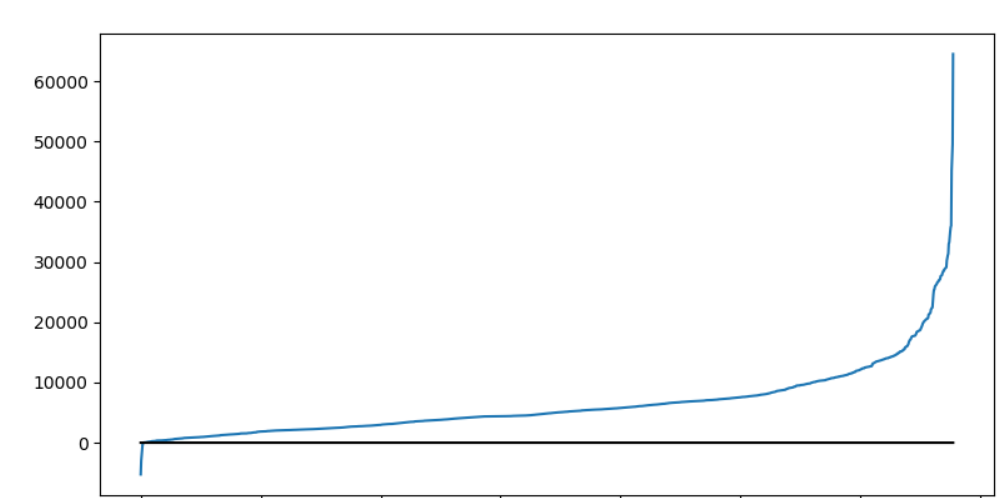

Lisa FOUGERON - François GRÉAU - Antoine ORGERIT

# TD 1 WebScraping

### Notes :

*L'écriture de ce rapport ayant débuté avant la formation du groupe, le code utilisé pour l'exercice 1 diffère de celui pour les autres exercices, ainsi que pour BoilerPipe*

*Si vous désirez exécuter notre code, pensez à adapter les chemins.*

# Exercice 1 : Utilisation d'outils de détourage

Nous nous basons sur le dossier *html* fourni, possédant les caractéristiques suivantes :

* 1694 fichiers, totalisant 127 002 561 caractères en 2 345 719 lignes
* 129 Mo.

On veut utiliser trois outils afin d'extraire le contenu des articles de ces fichiers. Pour ce faire, Nous avons développé un code en *python* permettant de créer des fichiers contenant les résultats en spécifiant une méthode de scraping :

```python
import glob
import os

# Parses through the given paths and applies the given scraping method
def parseFile(inputPath, outputPath, fileName, scrapingFunction):
    page = open(inputPath + fileName, encoding="utf-8", errors="ignore")
    pageContent = page.read()
    page.close()

    output = open(outputPath + fileName, "a", encoding="utf-8", errors="ignore")

    # Creates an empty file if the original file is empty
    if pageContent == "":
        output.write(" ")
    else:
        paragraphs = scrapingFunction(pageContent)
        for paragraph in paragraphs:
            if (paragraph.text):
                output.write("<p> " + paragraph.text.replace('\n', ' ') + " </p>\n")
        output.close()

# Parent folder and list of files 
folder = "D:/DocumentsHDD/M2/WebScraping/Corpus_detourage/" # À ADAPTER SI BESOIN
files = [f for f in glob.glob(folder + "html/*")]

# Placeholder for the future scraping methods
def scrapingMethodPlaceholder()

index = 1
for file in files: 
    os.system("cls")
    parseFile(folder + "html/", folder + "output/", file.split('\\')[-1], scrapingMethodPlaceholder)
    print("parsed " + str(index) + " out of " + str(len(files)) + " files")
    index += 1
```

Il ne reste plus qu'à définir des fonctions pour implémenter le fonctionnement des outils. 

## a. JusText

Pour le moment, nous n'identifions pas les langues dans lesquelles sont nos fichiers. L'exécution sera donc probablement plus lente et moins fiable.

```python
import justext

# JusText scraping method
def justextScraping(content):
    return justext.justext(content, "")
```

Résultat : le dossier généré pèse désormais 19,1 Mo.

## b. BoilerPipe

```python
from boilerpipe.extract import Extractor

# BoilerPipe scraping method
def boilerPipeScraping(content):
    extractor = Extractor(extractor="ArticleExtractor", html=content)
    return extractor.getHTML
```

Résultat : le dossier généré pèse désormais 7,41 Mo.

## c. BeautifulSoup

```python
from bs4 import BeautifulSoup

# Since the parseFile method requires objects with a text attribute
class Struct:
  def __init__(self, **entries):
    self.__dict__.update(entries)

# BeautifulSoup scraping method
def beautifulSoupScraping(content):
    soup = BeautifulSoup(content).stripped_strings
    out = []
    for elem in soup:
        out.append( Struct( **{"text": elem} ) )
    return out
```

Résultat : le dossier généré pèse désormais 53,5 Mo.

## Comparaisons

Afin de calculer les métriques relatives au nombre de caractères et de lignes entre les résultats obtenus et la référence, nous avons écrit le script suivant en *python* :

```python
import os
import math

def calculateAverage(referenceFolder, targetFolder):
    path = "D:/DocumentsHDD/M2/WebScraping/Corpus_detourage/"

    nbFiles = len(os.listdir(path + referenceFolder))

    initialCharNumber = 0
    initialLineNumber = 0
    folderCharNumber = 0
    folderLineNumber = 0
    varianceChar = 0
    varianceLine = 0

    for fileName in os.listdir(path + referenceFolder):

        # Reference folder
        currentFile = open(path + referenceFolder + "/" + fileName, encoding="utf-8", errors="ignore")
        content = currentFile.read()
        currentFile.close()
        initialCharNumber += len(content)
        initialLineNumber += content.count('\n')

        # Target folder
        currentFileTarget = open(path + targetFolder + "/" + fileName, encoding="utf-8", errors="ignore")
        contentTarget = currentFileTarget.read()
        currentFileTarget.close()
        folderCharNumber += len(contentTarget)
        folderLineNumber += contentTarget.count('\n')

        varianceChar += pow(len(content) - len(contentTarget), 2)
        varianceLine += pow(content.count('\n') - contentTarget.count('\n'), 2) 

    print("\nb total de caractères du dossier " + referenceFolder + " : " + str(initialCharNumber))
    print("nb total de lignes du dossier " + referenceFolder + " : " + str(initialLineNumber))
    
    print("\nnb total de caractères du dossier " + targetFolder + " : " + str(folderCharNumber))
    print("nb total de lignes du dossier " + targetFolder + " : " + str(folderLineNumber))

    print("\ndifférence moyenne de caractères : " + str((initialCharNumber - folderCharNumber) / nbFiles) )
    print("différence moyenne de lignes : " + str((initialLineNumber - folderLineNumber) / nbFiles) )

    print("\nvariance caractères : " + str(varianceChar / nbFiles) + " -> Ecart type caractères : " + str(math.sqrt(varianceChar / nbFiles)))
    print("variance lignes : " + str(varianceLine / nbFiles) + " -> Ecart type lignes : " + str(math.sqrt(varianceLine / nbFiles)))

# Attention ! Ne pas itérer à partir des fichiers de "clean" car il y a des fichiers en trop
calculateAverage("JT", "clean")
```

Grace à cela, nous relevons les données suivantes :

|                                                  | JT         | BP       | BS         |
| ------------------------------------------------ | ---------- | ---------|------------|
| Nombre de caractères                             | 14 659 367 |5 956 979 | 49 504 518 |
| Nombre de lignes                                 | 306 757    | 26 828   | 527 095    |
| Moyenne de la différence du nombre de caractères | 6 370.41   | 1 359.62 | 26 931.97  |
| Moyenne de la différence du nombre de lignes     | 166.6      | 9.52     | 296.71     | 
| Écart type du nombre de caractères               | 5 907.68   | 1 943.35 | 32 151.27  |
| Écart type du nombre de lignes                   | 125.18     | 13.42    | 214.78     |


### En plus : 

Afin d'observer plus facilement l'efficacité de ***JusText***, nous avons eu l'idée de générer un graphe décrivant la différence du nombre de caractères de chaque fichier entre les résultats de ***JT*** et la vérité terrain :



Nous pouvons alors facilement observer que mis à part de rares extrêmes, les différences sont relativement faibles.

# Exercice 2 : Guider le scraping avec la reconnaissance de langue

Afin d'accélérer l'exécution de ***JusText***, on veut connaître la langue de chaque fichier afin de l'indiquer lors du scraping. Pour ce faire, deux choix s'offrent à nous. On peut utiliser la librairie ***langid.py*** :

```python
def jt_langid_treatement(input_file, output_file):
    if input_file.read() != " ":
        input_file.seek(0)
        language = langid.classify(input_file.read())
        language = languages.get(alpha2=language[0]).name
        
        # Greek is the only poorly formatted one so we convert "Modern Greek (1453-)" into "Greek"
        if "Greek" in language:
            language = "Greek"
        # If language is unspecified, we choose English
        if language not in justext.get_stoplists():
            language = "English"
        
        input_file.seek(0)
        paragraphs = justext.justext(input_file.read(), justext.get_stoplist(language))
        
        for paragraph in paragraphs:
            output_file.write("<p>" + paragraph.text.replace("\n", " ") + "</p>\n")
    else:
        output_file.write(" ")
```

...ou bien le fichier JSON ***trueLg*** qui nous est fourni :

```python
def jt_truelg_treatement(input_file, output_file, file_name):
    if input_file.read() != " ":
        input_file.seek(0)
        languages = json.load(open("../../../resources/doc_lg.json"))
        
        language = languages[os.path.basename(file_name)]
        
        # If language is unspecified, we choose English 
        if language not in justext.get_stoplists():
            language = "English"
        
        paragraphs = justext.justext(input_file.read(), justext.get_stoplist(language))
        
        for paragraph in paragraphs:
            output_file.write("<p>" + paragraph.text.replace("\n", " ") + "</p>\n")
    else:
        output_file.write(" ")
```

En recalculant les métriques précédentes pour ***JusText***, on obtient les valeurs suivantes :

|                                                      | Valeur pour langid / trueLg |
| ---------------------------------------------------- | --------------------------- |
| **Nombre de caractères**                             | 14 048 036                  |
| **Nombre de ligne**s                                 | 306 755                     |
| **Moyenne de la différence du nombre de caractères** | 6 011.14                    |
| **Moyenne de la différence du nombre de lignes**     | 166.79                      |
| **Écart type du nombre de caractères**               | 5 702.18                    |
| **Écart type du nombre de lignes**                   | 125.18                      |

On se rend compte que les valeurs sont similaires à celles obtenues sans préciser la langue. Nous supposons que la différence se fait plutôt dans la vitesse d'exécution. 

Une bonne façon de s'en assurer est de comparer la vitesse d'exécution avec et sans la spécification de la langue au préalable. Pour cela, on relève le temps avant et après le traitement des 1694 fichiers.

* Sans spécification : 

```python
def main():
    total = 0
    begin = time.time() # Début 
    extract("../../Corpus_detourage/Corpus_detourage/html/", "../../Corpus_detourage/Corpus_detourage/JT/", jt_treatement)
    end = time.time() # Fin
    total = (end-begin)
    print("Temps : "+ str(total))
```

* Avec spécification :

Dans ce cas, il faut faire attention à ce que la détermination de la langue n'influe pas sur la durée de la mesure. Pour cela, nous avons choisi d'effectuer le test avec ***trueLg***, puisqu'aller chercher la valeur dans le fichier JSON prend un temps infime.

```python
def main():
    total = 0
    begin = time.time() # Début
    extract("../Corpus_detourage/Corpus_detourage/JT/", "../Corpus_detourage/Corpus_detourage/JTtrueLg/", jt_truelg_treatement)
    end = time.time() # Fin
    total = (end-begin)
    print("Temps : "+ str(total))
```

On relève les valeurs suivantes :

| Langue        | Temps d'exécution en ms |
| ------------- | ----------------------- |
| Non spécifiée | 87 199                  |
| Spécifiée     | 73 108                  |

Notre hypothèse est vérifiée : même en allant chercher les langues dans un fichier JSON, spécifier la langue lors de l'appel à ***JusText*** réduit la durée d'exécution de manière substantielle.

# Exercice 3 : Évaluation intrinsèque

* ## Mesure des valeurs de la F-Mesures, du Rappel et de la Précision  en fonction des langues

<table>
  <tr>
    <th rowspan="2" style="text-align:center; vertical-align:middle">OUTILS<br></th>
    <th colspan="3" style="text-align:center">All</th>
    <th colspan="3" style="text-align:center">el</th>
    <th colspan="3" style="text-align:center">pl</th>
  </tr>
  <tr>
    <td style="text-align:center">F</td>
    <td style="text-align:center">R</td>
    <td style="text-align:center">P</td>
    <td style="text-align:center">F</td>
    <td style="text-align:center">R</td>
    <td style="text-align:center">P</td>
    <td style="text-align:center">F</td>
    <td style="text-align:center">R</td>
    <td style="text-align:center">P</td>
  </tr>
  <tr>
    <td style="text-align:center">JT</td>
    <td style="text-align:center">34.67</td>
    <td style="text-align:center">88.81</td>
    <td style="text-align:center">23.90</td>
    <td style="text-align:center">44.36</td>
    <td style="text-align:center">97.58</td>
    <td style="text-align:center">30.45</td>
    <td style="text-align:center">43.08</td>
    <td style="text-align:center">94.29</td>
    <td style="text-align:center">30.34</td>
  </tr>
  <tr>
    <td style="text-align:center">BP</td>
    <td style="text-align:center">57.20</td>
    <td style="text-align:center">64.30</td>
    <td style="text-align:center">53.41</td>
    <td style="text-align:center">81.04</td>
    <td style="text-align:center">89.31</td>
    <td style="text-align:center">75.13</td>
    <td style="text-align:center">73.58</td>
    <td style="text-align:center">80.00</td>
    <td style="text-align:center">70.80</td>
  </tr>
  <tr>
    <td style="text-align:center">BS</td>
    <td style="text-align:center">21.14</td>
    <td style="text-align:center">88.44</td>
    <td style="text-align:center">13.32</td>
    <td style="text-align:center">23.43</td>
    <td style="text-align:center">97.49</td>
    <td style="text-align:center">14.83</td>
    <td style="text-align:center">30.37</td>
    <td style="text-align:center">94.20</td>
    <td style="text-align:center">19.48</td>
  </tr>
  <tr>
    <td style="text-align:center">JT_langid</td>
    <td style="text-align:center">38.91</td>
    <td style="text-align:center">92.89</td>
    <td style="text-align:center">27.38</td>
    <td style="text-align:center">48.14</td>
    <td style="text-align:center">96.61</td>
    <td style="text-align:center">34.04</td>
    <td style="text-align:center">46.11</td>
    <td style="text-align:center">93.10</td>
    <td style="text-align:center">33.26</td>
  </tr>
  <tr>
    <td style="text-align:center">JT_trueLg</td>
    <td style="text-align:center">38.91</td>
    <td style="text-align:center">92.89</td>
    <td style="text-align:center">27.38</td>
    <td style="text-align:center">48.14</td>
    <td style="text-align:center">96.61</td>
    <td style="text-align:center">34.04</td>
    <td style="text-align:center">46.11</td>
    <td style="text-align:center">93.10</td>
    <td style="text-align:center">33.26</td>
  </tr>
</table>

<table>
  <tr>
    <th rowspan="2" style="text-align:center; vertical-align:middle">OUTILS<br></th>
    <th colspan="3" style="text-align:center">ru</th>
    <th colspan="3" style="text-align:center">en</th>
    <th colspan="3" style="text-align:center">zh</th>
  </tr>
  <tr>
    <td style="text-align:center">F</td>
    <td style="text-align:center">R</td>
    <td style="text-align:center">P</td>
    <td style="text-align:center">F</td>
    <td style="text-align:center">R</td>
    <td style="text-align:center">P</td>
    <td style="text-align:center">F</td>
    <td style="text-align:center">R</td>
    <td style="text-align:center">P</td>
  </tr>
  <tr>
    <td style="text-align:center">JT</td>
    <td style="text-align:center">31.19</td>
    <td style="text-align:center">93.81</td>
    <td style="text-align:center">21.14</td>
    <td style="text-align:center">44.59</td>
    <td style="text-align:center">96.41</td>
    <td style="text-align:center">31.25</td>
    <td style="text-align:center">13.09</td>
    <td style="text-align:center">66.96</td>
    <td style="text-align:center">8.30</td>
  </tr>
  <tr>
    <td style="text-align:center">BP</td>
    <td style="text-align:center">59.14</td>
    <td style="text-align:center">70.13</td>
    <td style="text-align:center">54.89</td>
    <td style="text-align:center">76.57</td>
    <td style="text-align:center">84.54</td>
    <td style="text-align:center">71.54</td>
    <td style="text-align:center">6.02</td>
    <td style="text-align:center">9.21</td>
    <td style="text-align:center">4.73</td>
  </tr>
  <tr>
    <td style="text-align:center">BS</td>
    <td style="text-align:center">18.06</td>
    <td style="text-align:center">94.04</td>
    <td style="text-align:center">10.92</td>
    <td style="text-align:center">30.40</td>
    <td style="text-align:center">96.02</td>
    <td style="text-align:center">19.37</td>
    <td style="text-align:center">4.50</td>
    <td style="text-align:center">65.85</td>
    <td style="text-align:center">2.59</td>
  </tr>
  <tr>
    <td style="text-align:center">JT_langid</td>
    <td style="text-align:center">32.80</td>
    <td style="text-align:center">89.94</td>
    <td style="text-align:center">22.58</td>
    <td style="text-align:center">49.51</td>
    <td style="text-align:center">98.04</td>
    <td style="text-align:center">35.63</td>
    <td style="text-align:center">19.35</td>
    <td style="text-align:center">86.13</td>
    <td style="text-align:center">12.39</td>
  </tr>
  <tr>
    <td style="text-align:center">JT_trueLg</td>
    <td style="text-align:center">32.80</td>
    <td style="text-align:center">89.94</td>
    <td style="text-align:center">22.58</td>
    <td style="text-align:center">49.51</td>
    <td style="text-align:center">98.04</td>
    <td style="text-align:center">35.63</td>
    <td style="text-align:center">19.35</td>
    <td style="text-align:center">86.13</td>
    <td style="text-align:center">12.39</td>
  </tr>
</table>


* ## Mesure des valeurs de la F-Mesure, du Rappel et de la Précision en fonction des sources

<table>
  <tr>
    <th rowspan="2" style="text-align:center; vertical-align:middle">OUTILS<br></th>
    <th colspan="3" style="text-align:center">All</th>
    <th colspan="3" style="text-align:center">www.express.gr</th>
  </tr>
  <tr>
    <td style="text-align:center">F</td>
    <td style="text-align:center">R</td>
    <td style="text-align:center">P</td>
    <td style="text-align:center">F</td>
    <td style="text-align:center">R</td>
    <td style="text-align:center">P</td>
  </tr>
  <tr>
    <td style="text-align:center">JT</td>
    <td style="text-align:center">34.67</td>
    <td style="text-align:center">88.81</td>
    <td style="text-align:center">23.90</td>
    <td style="text-align:center">53.00</td>
    <td style="text-align:center">97.64</td>
    <td style="text-align:center">37.06</td>
  </tr>
  <tr>
    <td style="text-align:center">BP</td>
    <td style="text-align:center">57.20</td>
    <td style="text-align:center">64.30</td>
    <td style="text-align:center">53.41</td>
    <td style="text-align:center">85.99</td>
    <td style="text-align:center">92.83</td>
    <td style="text-align:center">80.32</td>
  </tr>
  <tr>
    <td style="text-align:center">BS</td>
    <td style="text-align:center">21.14</td>
    <td style="text-align:center">88.44</td>
    <td style="text-align:center">13.32</td>
    <td style="text-align:center">5.40</td>
    <td style="text-align:center">97.73</td>
    <td style="text-align:center">2.79</td>
  </tr>
  <tr>
    <td style="text-align:center">JT_langid</td>
    <td style="text-align:center">38.91</td>
    <td style="text-align:center">92.89</td>
    <td style="text-align:center">27.38</td>
    <td style="text-align:center">57.64</td>
    <td style="text-align:center">97.45</td>
    <td style="text-align:center">41.67</td>
  </tr>
  <tr>
    <td style="text-align:center">JT_trueLg</td>
    <td style="text-align:center">38.91</td>
    <td style="text-align:center">92.89</td>
    <td style="text-align:center">27.38</td>
    <td style="text-align:center">57.64</td>
    <td style="text-align:center">97.45</td>
    <td style="text-align:center">41.67</td>
  </tr>
</table>

<table>
  <tr>
    <th rowspan="2" align="center" style="text-align:center; vertical-align:middle">OUTILS<br></th>
    <th colspan="3" style="text-align:center">goodcontents.net</th>
    <th colspan="3" style="text-align:center">biolog.pl</th>
  </tr>
  <tr>
    <td style="text-align:center">F</td>
    <td style="text-align:center">R</td>
    <td style="text-align:center">P</td>
    <td style="text-align:center">F</td>
    <td style="text-align:center">R</td>
    <td style="text-align:center">P</td>
  </tr>
  <tr>
    <td style="text-align:center">JT</td>
    <td style="text-align:center">54.86</td>
    <td style="text-align:center">97.67</td>
    <td style="text-align:center">38.75</td>
    <td style="text-align:center">63.92</td>
    <td style="text-align:center">98.10</td>
    <td style="text-align:center">48.56</td>
  </tr>
  <tr>
    <td style="text-align:center">BP</td>
    <td style="text-align:center">87.64</td>
    <td style="text-align:center">92.52</td>
    <td style="text-align:center">83.63</td>
    <td style="text-align:center">85.89</td>
    <td style="text-align:center">89.54</td>
    <td style="text-align:center">82.70</td>
  </tr>
  <tr>
    <td style="text-align:center">BS</td>
    <td style="text-align:center">49.65</td>
    <td style="text-align:center">99.13</td>
    <td style="text-align:center">33.54</td>
    <td style="text-align:center">42.77</td>
    <td style="text-align:center">98.21</td>
    <td style="text-align:center">28.19</td>
  </tr>
  <tr>
    <td style="text-align:center">JT_langid</td>
    <td style="text-align:center">57.63</td>
    <td style="text-align:center">96.18</td>
    <td style="text-align:center">41.75</td>
    <td style="text-align:center">65.97</td>
    <td style="text-align:center">97.33</td>
    <td style="text-align:center">51.06</td>
  </tr>
  <tr>
    <td style="text-align:center">JT_trueLg</td>
    <td style="text-align:center">57.63</td>
    <td style="text-align:center">96.18</td>
    <td style="text-align:center">41.75</td>
    <td style="text-align:center">65.97</td>
    <td style="text-align:center">97.33</td>
    <td style="text-align:center">51.06</td>
  </tr>
</table>

# Exercice 4 : Extension

On part désormais sur trois autres méthodes d'extraction, ***Unfluff***, ***Victor*** et ***Body Text Extractor***.

## a. Unfluff

Afin d'utiliser ***Unfluff***, nous avons écrit et exécuté le code *javascript* suivant :

```javascript
var extractor = require('unfluff');
var fs = require('fs');

var source_files_path = '../../resources/html/';
var dest_files_path = '../../resources/unfluff/'
var files = fs.readdirSync(source_files_path);

files.forEach(function(file) {
    fs.readFile(source_files_path + file, function(err, content) {
        if (err) {
            console.log(err);
        } else {
            data = extractor(content)
            content_to_write = ' ';
            if (data.text != '') {
                content_to_write = data.text
            }
            fs.appendFile(dest_files_path + file, content_to_write, function(
                    err) {
                if (err) {
                    console.log(err);
                }
            });
        }
    });
});
```

## b. Victor

*Malgré nos efforts et une installation réalisée en suivant scrupuleusement la documentation, nous n'avons pas réussi à faire fonctionner Victor.*

## c. Body Text Extractor

L'utilisation de ***BTE*** est très similaire à celle de ***JusText***, aussi nous n'allons pas la détailler en profondeur. 

## Comparaisons

|                                                      | UF        | BTE       |
| ---------------------------------------------------- | --------- | --------- |
| **Nombre de caractères**                             | 1 784 829 | 5 946 865 |
| **Nombre de lignes**                                 | 20 475    | 3 388     |
| **Moyenne de la différence du nombre de caractères** | 1 413.07  | 1 906.36  |
| **Moyenne de la différence du nombre de lignes**     | 12.60     | 12.48     |
| **Écart type du nombre de caractères**               | 1842.42   | 4316.50   |
| **Écart type du nombre de lignes**                   | 14.68     | 9.75      |


* ## Relevé des F, R et P en fonction des langues :

<table>
  <tr>
    <th rowspan="2" style="text-align:center; vertical-align:middle">OUTILS<br></th>
    <th colspan="3" style="text-align:center">All</th>
    <th colspan="3" style="text-align:center">el</th>
    <th colspan="3" style="text-align:center">pl</th>
  </tr>
  <tr>
    <td style="text-align:center">F</td>
    <td style="text-align:center">R</td>
    <td style="text-align:center">P</td>
    <td style="text-align:center">F</td>
    <td style="text-align:center">R</td>
    <td style="text-align:center">P</td>
    <td style="text-align:center">F</td>
    <td style="text-align:center">R</td>
    <td style="text-align:center">P</td>
  </tr>
  <tr>
    <td style="text-align:center">UF</td>
    <td style="text-align:center">35.42</td>
    <td style="text-align:center">32.23</td>
    <td style="text-align:center">93.42</td>
    <td style="text-align:center">2.11</td>
    <td style="text-align:center">1.26</td>
    <td style="text-align:center">98.52</td>
    <td style="text-align:center">46.18</td>
    <td style="text-align:center">41.54</td>
    <td style="text-align:center">84.17</td>
  </tr>
  <tr>
    <td style="text-align:center">BTE</td>
    <td style="text-align:center">56.80</td>
    <td style="text-align:center">65.21</td>
    <td style="text-align:center">59.61</td>
    <td style="text-align:center">74.06</td>
    <td style="text-align:center">88.22</td>
    <td style="text-align:center">67.86</td>
    <td style="text-align:center">71.39</td>
    <td style="text-align:center">80.31</td>
    <td style="text-align:center">70.50</td>
  </tr>
</table>

<table>
  <tr>
    <th rowspan="2" style="text-align:center; vertical-align:middle">OUTILS<br></th>
    <th colspan="3" style="text-align:center">ru</th>
    <th colspan="3" style="text-align:center">en</th>
    <th colspan="3" style="text-align:center">zh</th>
  </tr>
  <tr>
    <td style="text-align:center">F</td>
    <td style="text-align:center">R</td>
    <td style="text-align:center">P</td>
     <td style="text-align:center">F</td>
    <td style="text-align:center">R</td>
    <td style="text-align:center">P</td>
    <td style="text-align:center">F</td>
    <td style="text-align:center">R</td>
    <td style="text-align:center">P</td>
  </tr>
  <tr>
    <td style="text-align:center">UF</td>
    <td style="text-align:center">2.15</td>
    <td style="text-align:center">1.14</td>
    <td style="text-align:center">97.06</td>
    <td style="text-align:center">83.40</td>
    <td style="text-align:center">81.88</td>
    <td style="text-align:center">88.17</td>
    <td style="text-align:center">16.03</td>
    <td style="text-align:center">8.87</td>
    <td style="text-align:center">100.00</td>
  </tr>
  <tr>
    <td style="text-align:center">BTE</td>
    <td style="text-align:center">55.04</td>
    <td style="text-align:center">68.67</td>
    <td style="text-align:center">55.75</td>
    <td style="text-align:center">70.02</td>
    <td style="text-align:center">82.34</td>
    <td style="text-align:center">70.38</td>
    <td style="text-align:center">20.93</td>
    <td style="text-align:center">17.05</td>
    <td style="text-align:center">36.56</td>
  </tr>
</table>


* ## Relevé des F, R et P en fonction des sources :

<table>
  <tr>
    <th rowspan="2" style="text-align:center; vertical-align:middle">OUTILS<br></th>
    <th colspan="3" style="text-align:center">All</th>
    <th colspan="3" style="text-align:center">www.express.gr</th>
  </tr>
  <tr>
    <td style="text-align:center">F</td>
    <td style="text-align:center">R</td>
    <td style="text-align:center">P</td>
    <td style="text-align:center">F</td>
    <td style="text-align:center">R</td>
    <td style="text-align:center">P</td>
  </tr>
  <tr>
    <td style="text-align:center">UF</td>
    <td style="text-align:center">35.42</td>
    <td style="text-align:center">32.23</td>
    <td style="text-align:center">93.42</td>
    <td style="text-align:center">2.75</td>
    <td style="text-align:center">2.00</td>
    <td style="text-align:center">99.95</td>
  </tr>
  <tr>
    <td style="text-align:center">BTE</td>
    <td style="text-align:center">56.80</td>
    <td style="text-align:center">65.21</td>
    <td style="text-align:center">59.61</td>
    <td style="text-align:center">90.00</td>
    <td style="text-align:center">94.48</td>
    <td style="text-align:center">86.08</td>
  </tr>
  </tr>
</table>

<table>
  <tr>
    <th rowspan="2" style="text-align:center; vertical-align:middle">OUTILS<br></th>
    <th colspan="3" style="text-align:center">goodcontents.net</th>
    <th colspan="3" style="text-align:center">biolog.pl</th>
  </tr>
  <tr>
    <td style="text-align:center">F</td>
    <td style="text-align:center">R</td>
    <td style="text-align:center">P</td>
    <td style="text-align:center">F</td>
    <td style="text-align:center">R</td>
    <td style="text-align:center">P</td>
  </tr>
  <tr>
    <td style="text-align:center">UF</td>
    <td style="text-align:center">90.84</td>
    <td style="text-align:center">93.70</td>
    <td style="text-align:center">88.38</td>
    <td style="text-align:center">61.02</td>
    <td style="text-align:center">55.72</td>
    <td style="text-align:center">89.15</td>
  </tr>
  <tr>
    <td style="text-align:center">BTE</td>
    <td style="text-align:center">61.63</td>
    <td style="text-align:center">96.07</td>
    <td style="text-align:center">45.97</td>
    <td style="text-align:center">87.76</td>
    <td style="text-align:center">86.74</td>
    <td style="text-align:center">88.88</td>
  </tr>
  </tr>
</table>

# Exercice 5 : Évaluation extrinsèque


Le code Daniel a été adapté pour être utilisé par notre code personnel et pour correspondre à notre cas d'utilisation. Les changements effectués ont été spécifié aux débuts des fichiers correspondants et à l'endroit même où les modifications ont été effectuées le cas échéant. La méthode de vérification *getResults* du fichier <u>evaluate.py</u> a notamment été modifiée pour prendre en paramètre une fonction d'extraction de critère de recherche au lieu de directement effectuer le processus par langage, ce qui permet de mettre en place une évaluation par sources.

* ## Relevé des TP, FP, FN et TN :

<table>
  <tr>
    <th style="text-align:center">OUTILS<br></th>
    <th style="text-align:center">TP</th>
    <th style="text-align:center">FP</th>
    <th style="text-align:center">FN</th>
    <th style="text-align:center">TN</th>
  </tr>
  <tr>
    <td style="text-align:center">JT</td>
    <td style="text-align:center">8</td>
    <td style="text-align:center">1</td>
    <td style="text-align:center">116</td>
    <td style="text-align:center">1 569</td>
  </tr>
    <tr>
    <td style="text-align:center">BP</td>
    <td style="text-align:center">0</td>
    <td style="text-align:center">0</td>
    <td style="text-align:center">124</td>
    <td style="text-align:center">1 570</td>
  </tr> 
    <tr>
    <td style="text-align:center">BS</td>
    <td style="text-align:center">76</td>
    <td style="text-align:center">48</td>
    <td style="text-align:center">48</td>
    <td style="text-align:center">1 522</td>
  </tr>
    <tr>
    <td style="text-align:center">JT_langid</td>
    <td style="text-align:center">8</td>
    <td style="text-align:center">1</td>
    <td style="text-align:center">116</td>
    <td style="text-align:center">1 569</td>
  </tr>
    <tr>
    <td style="text-align:center">JT_trueLg</td>
    <td style="text-align:center">8</td>
    <td style="text-align:center">1</td>
    <td style="text-align:center">116</td>
    <td style="text-align:center">1 569</td>
  </tr>
    <tr>
    <td style="text-align:center">UF</td>
    <td style="text-align:center">41</td>
    <td style="text-align:center">56</td>
    <td style="text-align:center">83</td>
    <td style="text-align:center">1 514</td>
  </tr>
    <tr>
    <td style="text-align:center">BT</td>
    <td style="text-align:center">85</td>
    <td style="text-align:center">147</td>
    <td style="text-align:center">39</td>
    <td style="text-align:center">1 423</td>
  </tr>
</table>


* ## Relevé des F, R et P en fonction des langues :

<table>
  <tr>
    <th rowspan="2" style="text-align:center; vertical-align:middle">OUTILS<br></th>
    <th colspan="3" style="text-align:center">All</th>
    <th colspan="3" style="text-align:center">en</th>
    <th colspan="3" style="text-align:center">cn</th>
  </tr>
  <tr>
    <td style="text-align:center">F</td>
    <td style="text-align:center">R</td>
    <td style="text-align:center">P</td>
    <td style="text-align:center">F</td>
    <td style="text-align:center">R</td>
    <td style="text-align:center">P</td>
    <td style="text-align:center">F</td>
    <td style="text-align:center">R</td>
    <td style="text-align:center">P</td>
  </tr>
  <tr>
    <td style="text-align:center">JT</td>
    <td style="text-align:center">0.12</td>
    <td style="text-align:center">0.06</td>
    <td style="text-align:center">0.89</td>
    <td style="text-align:center">0.33</td>
    <td style="text-align:center">0.20</td>
    <td style="text-align:center">0.88</td>
    <td style="text-align:center">0.00</td>
    <td style="text-align:center">0.00</td>
    <td style="text-align:center">0.00</td>
  </tr>
  <tr>
    <td style="text-align:center">BP</td>
    <td style="text-align:center">0.00</td>
    <td style="text-align:center">0.00</td>
    <td style="text-align:center">0.00</td>
    <td style="text-align:center">0.00</td>
    <td style="text-align:center">0.00</td>
    <td style="text-align:center">0.00</td>
    <td style="text-align:center">0.00</td>
    <td style="text-align:center">0.00</td>
    <td style="text-align:center">0.00</td>
  </tr>
   <tr>
    <td style="text-align:center">BS</td>
    <td style="text-align:center">0.61</td>
    <td style="text-align:center">0.61</td>
    <td style="text-align:center">0.61</td>
    <td style="text-align:center">0.54</td>
    <td style="text-align:center">0.60</td>
    <td style="text-align:center">0.49</td>
    <td style="text-align:center">0.00</td>
    <td style="text-align:center">0.00</td>
    <td style="text-align:center">0.00</td>
  </tr>
   <tr>
    <td style="text-align:center">JT_langid</td>
    <td style="text-align:center">0.12</td>
    <td style="text-align:center">0.06</td>
    <td style="text-align:center">0.89</td>
    <td style="text-align:center">0.33</td>
    <td style="text-align:center">0.20</td>
    <td style="text-align:center">0.88</td>
    <td style="text-align:center">0.00</td>
    <td style="text-align:center">0.00</td>
    <td style="text-align:center">0.00</td>
  </tr>
   <tr>
    <td style="text-align:center">JT_trueLg</td>
    <td style="text-align:center">0.12</td>
    <td style="text-align:center">0.06</td>
    <td style="text-align:center">0.89</td>
    <td style="text-align:center">0.33</td>
    <td style="text-align:center">0.20</td>
    <td style="text-align:center">0.88</td>
    <td style="text-align:center">0.00</td>
    <td style="text-align:center">0.00</td>
    <td style="text-align:center">0.00</td>
  </tr>
   <tr>
    <td style="text-align:center">UF</td>
    <td style="text-align:center">0.37</td>
    <td style="text-align:center">0.33</td>
    <td style="text-align:center">0.42</td>
    <td style="text-align:center">0.52</td>
    <td style="text-align:center">0.86</td>
    <td style="text-align:center">0.38</td>
    <td style="text-align:center">0.00</td>
    <td style="text-align:center">0.00</td>
    <td style="text-align:center">0.00</td>
  </tr>
   <tr>
    <td style="text-align:center">BTE</td>
    <td style="text-align:center">0.48</td>
    <td style="text-align:center">0.69</td>
    <td style="text-align:center">0.37</td>
    <td style="text-align:center">0.35</td>
    <td style="text-align:center">0.74</td>
    <td style="text-align:center">0.23</td>
    <td style="text-align:center">0.00</td>
    <td style="text-align:center">0.00</td>
    <td style="text-align:center">0.00</td>
  </tr>
</table>

<table>
  <tr>
    <th rowspan="2" style="text-align:center; vertical-align:middle">OUTILS<br></th>
    <th colspan="3" style="text-align:center">ru</th>
    <th colspan="3" style="text-align:center">el</th>
    <th colspan="3" style="text-align:center">pl</th>
  </tr>
  <tr>
    <td style="text-align:center">F</td>
    <td style="text-align:center">R</td>
    <td style="text-align:center">P</td>
    <td style="text-align:center">F</td>
    <td style="text-align:center">R</td>
    <td style="text-align:center">P</td>
    <td style="text-align:center">F</td>
    <td style="text-align:center">R</td>
    <td style="text-align:center">P</td>
  </tr>
  <tr>
    <td style="text-align:center">JT</td>
    <td style="text-align:center">0.07</td>
    <td style="text-align:center">0.03</td>
    <td style="text-align:center">1.00</td>
    <td style="text-align:center">0.00</td>
    <td style="text-align:center">0.00</td>
    <td style="text-align:center">0.00</td>
    <td style="text-align:center">0.00</td>
    <td style="text-align:center">0.00</td>
    <td style="text-align:center">0.00</td>
  </tr>
  <tr>
    <td style="text-align:center">BP</td>
    <td style="text-align:center">0.00</td>
    <td style="text-align:center">0.00</td>
    <td style="text-align:center">0.00</td>
    <td style="text-align:center">0.00</td>
    <td style="text-align:center">0.00</td>
    <td style="text-align:center">0.00</td>
    <td style="text-align:center">0.00</td>
    <td style="text-align:center">0.00</td>
    <td style="text-align:center">0.00</td>
  </tr>
   <tr>
    <td style="text-align:center">BS</td>
    <td style="text-align:center">0.73</td>
    <td style="text-align:center">0.76</td>
    <td style="text-align:center">0.71</td>
    <td style="text-align:center">0.59</td>
    <td style="text-align:center">0.59</td>
    <td style="text-align:center">0.59</td>
    <td style="text-align:center">0.77</td>
    <td style="text-align:center">0.85</td>
    <td style="text-align:center">0.70</td>
  </tr>
   <tr>
    <td style="text-align:center">JT_langid</td>
    <td style="text-align:center">0.07</td>
    <td style="text-align:center">0.03</td>
    <td style="text-align:center">1.00</td>
    <td style="text-align:center">0.00</td>
    <td style="text-align:center">0.00</td>
    <td style="text-align:center">0.00</td>
    <td style="text-align:center">0.00</td>
    <td style="text-align:center">0.00</td>
    <td style="text-align:center">0.00</td>
  </tr>
   <tr>
    <td style="text-align:center">JT_trueLg</td>
    <td style="text-align:center">0.07</td>
    <td style="text-align:center">0.03</td>
    <td style="text-align:center">1.00</td>
    <td style="text-align:center">0.00</td>
    <td style="text-align:center">0.00</td>
    <td style="text-align:center">0.00</td>
    <td style="text-align:center">0.00</td>
    <td style="text-align:center">0.00</td>
    <td style="text-align:center">0.00</td>
  </tr>
   <tr>
    <td style="text-align:center">UF</td>
    <td style="text-align:center">0.00</td>
    <td style="text-align:center">0.00</td>
    <td style="text-align:center">0.00</td>
    <td style="text-align:center">0.00</td>
    <td style="text-align:center">0.00</td>
    <td style="text-align:center">0.00</td>
    <td style="text-align:center">0.50</td>
    <td style="text-align:center">0.41</td>
    <td style="text-align:center">0.65</td>
  </tr>
   <tr>
    <td style="text-align:center">BTE</td>
    <td style="text-align:center">0.62</td>
    <td style="text-align:center">0.86</td>
    <td style="text-align:center">0.48</td>
    <td style="text-align:center">0.53</td>
    <td style="text-align:center">0.76</td>
    <td style="text-align:center">0.41</td>
    <td style="text-align:center">0.69</td>
    <td style="text-align:center">0.78</td>
    <td style="text-align:center">0.62</td>
  </tr>
</table>

* ## Relevé des  F, R et P en fonction des sources

<table>
  <tr>
    <th rowspan="2" style="text-align:center; vertical-align:middle">OUTILS<br></th>
    <th colspan="3" style="text-align:center">All</th>
    <th colspan="3" style="text-align:center">ibnlive.in.com</th>
  </tr>
  <tr>
    <td style="text-align:center">F</td>
    <td style="text-align:center">R</td>
    <td style="text-align:center">P</td>
    <td style="text-align:center">F</td>
    <td style="text-align:center">R</td>
    <td style="text-align:center">P</td>
  </tr>
  <tr>
    <td style="text-align:center">JT</td>
    <td style="text-align:center">0.12</td>
    <td style="text-align:center">0.06</td>
    <td style="text-align:center">0.89</td>
    <td style="text-align:center">0.00</td>
    <td style="text-align:center">0.00</td>
    <td style="text-align:center">0.00</td>
  </tr>
  <tr>
    <td style="text-align:center">BP</td>
    <td style="text-align:center">0.00</td>
    <td style="text-align:center">0.00</td>
    <td style="text-align:center">0.00</td>
    <td style="text-align:center">0.00</td>
    <td style="text-align:center">0.00</td>
    <td style="text-align:center">0.00</td>
  </tr>
   <tr>
    <td style="text-align:center">BS</td>
    <td style="text-align:center">0.61</td>
    <td style="text-align:center">0.61</td>
    <td style="text-align:center">0.61</td>
    <td style="text-align:center">0.67</td>
    <td style="text-align:center">1.00</td>
    <td style="text-align:center">0.50</td>
  </tr>
   <tr>
    <td style="text-align:center">JT_langid</td>
    <td style="text-align:center">0.12</td>
    <td style="text-align:center">0.06</td>
    <td style="text-align:center">0.89</td>
    <td style="text-align:center">0.00</td>
    <td style="text-align:center">0.00</td>
    <td style="text-align:center">0.00</td>
  </tr>
   <tr>
    <td style="text-align:center">JT_trueLg</td>
    <td style="text-align:center">0.12</td>
    <td style="text-align:center">0.06</td>
    <td style="text-align:center">0.89</td>
    <td style="text-align:center">0.00</td>
    <td style="text-align:center">0.00</td>
    <td style="text-align:center">0.00</td>
  </tr>
   <tr>
    <td style="text-align:center">UF</td>
    <td style="text-align:center">0.37</td>
    <td style="text-align:center">0.33</td>
    <td style="text-align:center">0.42</td>
    <td style="text-align:center">0.00</td>
    <td style="text-align:center">0.00</td>
    <td style="text-align:center">0.00</td>
  </tr>
   <tr>
    <td style="text-align:center">BTE</td>
    <td style="text-align:center">0.48</td>
    <td style="text-align:center">0.69</td>
    <td style="text-align:center">0.37</td>
    <td style="text-align:center">0.00</td>
    <td style="text-align:center">0.00</td>
    <td style="text-align:center">0.00</td>
  </tr>
</table>

<table>
  <tr>
    <th rowspan="2" style="text-align:center; vertical-align:middle">OUTILS<br></th>
    <th colspan="3" style="text-align:center">www.bbc.co.uk</th>
    <th colspan="3" style="text-align:center">www.abc.net.au</th>
  </tr>
  <tr>
    <td style="text-align:center">F</td>
    <td style="text-align:center">R</td>
    <td style="text-align:center">P</td>
    <td style="text-align:center">F</td>
    <td style="text-align:center">R</td>
    <td style="text-align:center">P</td>
  </tr>
  <tr>
    <td style="text-align:center">JT</td>
    <td style="text-align:center">0.00</td>
    <td style="text-align:center">0.00</td>
    <td style="text-align:center">0.00</td>
    <td style="text-align:center">0.00</td>
    <td style="text-align:center">0.00</td>
    <td style="text-align:center">0.00</td>
  </tr>
  <tr>
    <td style="text-align:center">BP</td>
    <td style="text-align:center">0.00</td>
    <td style="text-align:center">0.00</td>
    <td style="text-align:center">0.00</td>
    <td style="text-align:center">0.00</td>
    <td style="text-align:center">0.00</td>
    <td style="text-align:center">0.00</td>
  </tr>
   <tr>
    <td style="text-align:center">BS</td>
    <td style="text-align:center">0.80</td>
    <td style="text-align:center">1.00</td>
    <td style="text-align:center">0.67</td>
    <td style="text-align:center">0.67</td>
    <td style="text-align:center">1.00</td>
    <td style="text-align:center">0.50</td>
  </tr>
   <tr>
    <td style="text-align:center">JT_langid</td>
    <td style="text-align:center">0.00</td>
    <td style="text-align:center">0.00</td>
    <td style="text-align:center">0.00</td>
    <td style="text-align:center">0.00</td>
    <td style="text-align:center">0.00</td>
    <td style="text-align:center">0.00</td>
  </tr>
   <tr>
    <td style="text-align:center">JT_trueLg</td>
    <td style="text-align:center">0.00</td>
    <td style="text-align:center">0.00</td>
    <td style="text-align:center">0.00</td>
    <td style="text-align:center">0.00</td>
    <td style="text-align:center">0.00</td>
    <td style="text-align:center">0.00</td>
  </tr>
   <tr>
    <td style="text-align:center">UF</td>
    <td style="text-align:center">0.40</td>
    <td style="text-align:center">0.50</td>
    <td style="text-align:center">0.33</td>
    <td style="text-align:center">1.00</td>
    <td style="text-align:center">1.00</td>
    <td style="text-align:center">1.00</td>
  </tr>
   <tr>
    <td style="text-align:center">BTE</td>
    <td style="text-align:center">0.50</td>
    <td style="text-align:center">1.00</td>
    <td style="text-align:center">0.33</td>
    <td style="text-align:center">0.67</td>
    <td style="text-align:center">1.00</td>
    <td style="text-align:center">0.50</td>
  </tr>
</table>

